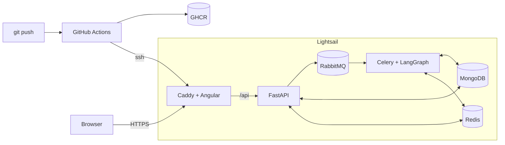

# Deployment

One AWS Lightsail instance ($7/month, 1GB RAM + 2GB swap) runs the stack with Docker Compose.
Terraform creates the server once. Every push to `main` builds the images in GitHub Actions, pushes them to GHCR, and deploys them over SSH.



| Path | Purpose |
|---|---|
| `*.Dockerfile` | Production images; the build context is the module folder |
| `docker-compose.prod.yml` | The stack; CI copies it to `/opt/agent-demo/compose.yaml` |
| `Caddyfile` | HTTPS, Angular routes, `/api` proxy |
| `init-mongo.js` | Creates the app's Mongo user on first start |
| `infra/` | Terraform for the instance, static IP and firewall; `cloud-init.sh` adds swap and Docker |
| `../.github/workflows/deploy.yml` | Build and deploy |

The local dev setup is unchanged.

## Setup

1. **Tools:** `winget install Hashicorp.Terraform Amazon.AWSCLI GitHub.cli`
2. **AWS:**
   - Create an IAM user with this policy: `{"Version":"2012-10-17","Statement":[{"Effect":"Allow","Action":"lightsail:*","Resource":"*"}]}`
   - Create an access key for it.
   - Run `aws configure` and set the region to `ca-central-1`.
3. **SSH key:** `ssh-keygen -t ed25519 -f ~/.ssh/agent-demo` with an empty passphrase.
4. **Server:** run `cd deploy/infra; terraform init; terraform apply`. It prints `public_ip`.
5. **DuckDNS:** at <https://www.duckdns.org>, add a subdomain and point it at `public_ip`.
6. **GitHub:** run these in Git Bash, not PowerShell. PowerShell pipes corrupt the key.
   ```sh
   gh variable set DEPLOY_HOST --body <public_ip>
   gh variable set DOMAIN --body <name>.duckdns.org
   gh variable set LANGUAGE_MODEL --body nvidia/nemotron-3-super-120b-a12b
   gh variable set LANGUAGE_MODEL_BASE_URL --body https://integrate.api.nvidia.com/v1
   gh secret set DEPLOY_SSH_KEY < ~/.ssh/agent-demo
   gh secret set LANGUAGE_MODEL_API_KEY
   for s in MONGO_ROOT_PASSWORD MONGO_DB_PASSWORD RABBITMQ_PASSWORD REDIS_PASSWORD; do
     gh secret set $s --body "$(openssl rand -hex 24)"
   done
   ```
7. **Deploy:** push to `main`.

## Operations

- **Logs:** `ssh -i ~/.ssh/agent-demo ubuntu@<ip>`, then `cd /opt/agent-demo && docker compose ps` or `docker compose logs -f worker`.
- **Rollback:** re-run an older deploy run in the Actions tab.
- **Resize:** `terraform apply -var bundle_id=small_3_0`.
- **Teardown:** `terraform destroy`.

Replacing the instance wipes its data. That happens on a resize or any change to `cloud-init.sh`. Afterwards run `ssh-keygen -R <ip>` and redeploy.

## Gotchas

- **Production uses MongoDB 7.0.** MongoDB 8.x refuses to start on Lightsail's Linux 7.0 kernel ([SERVER-121912](https://jira.mongodb.org/browse/SERVER-121912)).
- **Mongo passwords are set once.** They are applied on the first start only. To change them, run `docker compose down -v` on the server, which wipes the data.
- **`cloud-init.sh` must be POSIX `sh`.** Lightsail prepends its own `#!/bin/sh` script, so the file runs under dash.
- **Keep `infra/terraform.tfstate`.** It is git-ignored and only exists locally.
